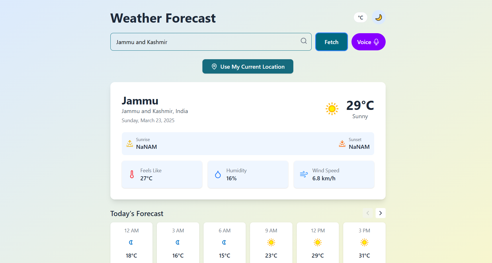

# Weather Forecast Application

A modern weather forecast application built with React that provides current weather conditions, hourly forecasts, and 7-day weather predictions. The app features a clean UI with dark/light mode, temperature unit conversion, and voice search capabilities.



## Features

- Current weather conditions display
- Hourly forecast (3-hour intervals)
- 7-day weather forecast
- Location search by city name or postal code
- Geolocation support to detect user's current location
- Voice search functionality
- Temperature unit toggle (°C/°F)
- Dark/light mode theme toggle
- Responsive design for all device sizes

## Prerequisites

Before running this project, you need to have the following installed:
- [Node.js](https://nodejs.org/) (v14.0.0 or later)
- npm (usually comes with Node.js) or [Yarn](https://yarnpkg.com/)

## Getting Started

Follow these steps to set up and run the project locally:

### 1. Clone the repository

```bash
git clone https://github.com/Mil9nn/PRODIGY_WD_05.git
cd weather-app
```

### 2. Install dependencies

Using npm:
```bash
npm install
```

Or using Yarn:
```bash
yarn
```

### 3. Set up environment variables

The application uses the WeatherAPI service. You need to create an account on [WeatherAPI](https://www.weatherapi.com/) and get an API key.

Create a `.env` file in the root directory of the project and add your API key:

```
VITE_WEATHER_API_KEY=your_api_key_here
```

### 4. Update the API key in the code

In `src/components/Hero.jsx`, replace the hardcoded API key with the environment variable:

```javascript
// Change this line:
const weather_api_key = '6146c7a50abb417f80f63318252303';

// To this:
const weather_api_key = import.meta.env.VITE_WEATHER_API_KEY;
```

### 5. Start the development server

Using npm:
```bash
npm run dev
```

Or using Yarn:
```bash
yarn dev
```

The application will be available at `http://localhost:5173` (or another port if 5173 is already in use).

## Building for Production

To create a production build, run:

Using npm:
```bash
npm run build
```

Or using Yarn:
```bash
yarn build
```

The build files will be generated in the `dist` directory.

## Dependencies

The project uses the following main dependencies:
- React
- Lucide React (for icons)
- React-Toastify (for notifications)
- Tailwind CSS (for styling)

## Browser Compatibility

The application works best in modern browsers that support:
- Geolocation API
- Web Speech API (for voice search)
- CSS Grid Layout

## License

[MIT License](LICENSE)

## Acknowledgements

- Weather data provided by [WeatherAPI](https://www.weatherapi.com/)
- Icons by [Lucide](https://lucide.dev/)